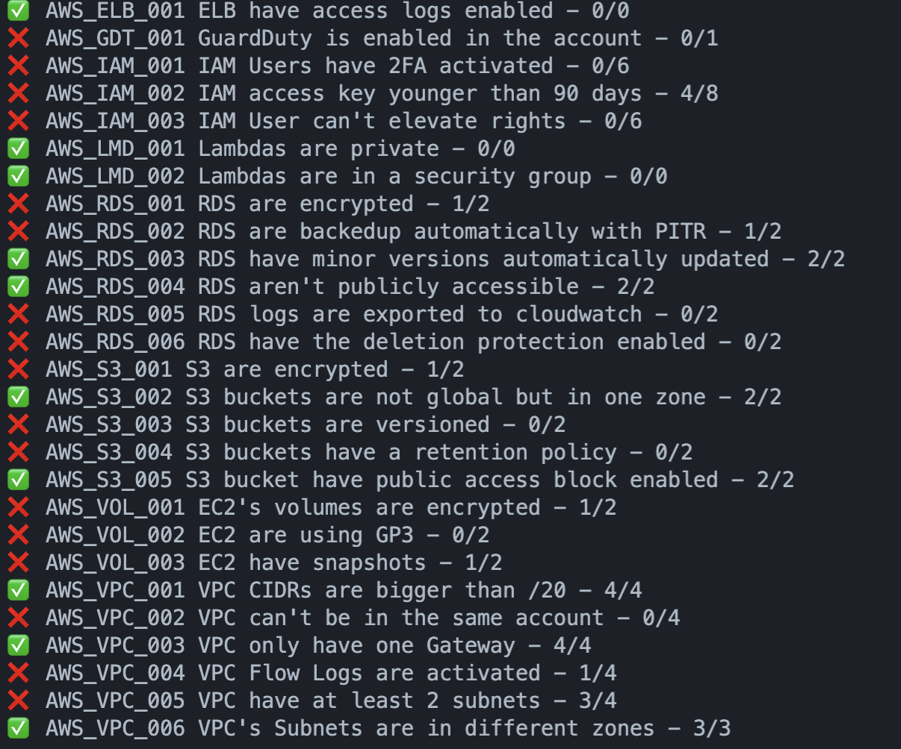
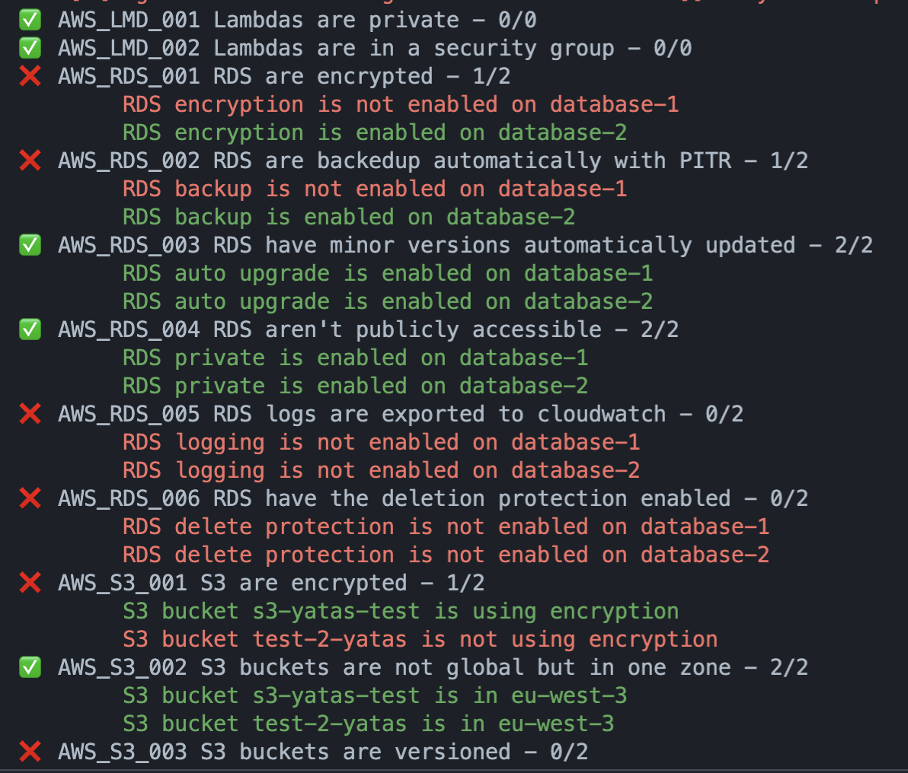

<p align="center">

<p align="center">

# YATAS
[](https://codecov.io/gh/padok-team/YATAS) [](https://goreportcard.com/badge/github.com/padok-team/yatas)

Yet Another Testing &amp; Auditing Solution 

The goal of YATAS is to help you create a secure AWS environment without too much hassle. It won't check for all best practices but only for the ones that are important for you based on my experience. Please feel free to tell me if you find something that is not covered.

## Features
YATAS is a simple and easy to use tool to audit your infrastructure for misconfiguration or potential security issues.

<p align="center">

<p align="center">

| No details                | Details
|:-------------------------:|:-------------------------:
|       |  

## Installation

```bash
brew tap padok-team/tap
brew install yatas
```

```bash
yatas --init
```

Modify .yatas.yml to your needs.

```bash
yatas --install
```

Installs the plugins you need.

## Usage

```bash
yatas -h
```

Flags:
- `--details`: Show details of the issues found.
- `--compare`: Compare the results of the previous run with the current run and show the differences.
- `--ci`: Exit code 1 if there are issues found, 0 otherwise.
- `--resume`: Only shows the number of tests passing and failing.
- `--time`: Shows the time each test took to run in order to help you find bottlenecks.
- `--init`: Creates a .yatas.yml file in the current directory.
- `--install`: Installs the plugins you need.
- `--only-failure`: Only show the tests that failed.

## Plugins

**Checks Plugins**

| Plugins | Description | Checks |
|------|-------------|--------|
| [*AWS Audit*](https://github.com/padok-team/yatas-aws) | AWS checks | Good practices and security checks|
| [*GCP Audit*](https://github.com/padok-team/yatas-gcp) | GCP checks | Good practices and security checks|

**Reporting Plugins**

| Plugins | Description |
|------|-------------|
| [*Markdown Reports*](https://github.com/padok-team/yatas-markdown) |  Generates a markdown report |
| [*Notion Reports*](https://github.com/Thibaut-Padok/yatas-notion) |  Generates a Notion Database report |
| [*HTML Reports*](https://github.com/Thibaut-Padok/yatas-html) | Generates an HTLM report |

## Checks

### Ignore results for known issues
You can ignore results of checks by adding the following to your `.yatas.yml` file:

```yaml
ignore:
  - id: "AWS_VPC_004"
    regex: true
    values: 
      - "VPC Flow Logs are not enabled on vpc-.*"
  - id: "AWS_VPC_003"
    regex: false
    values: 
      - "VPC has only one gateway on vpc-08ffec87e034a8953"
```

### Exclude a test
You can exclude a test by adding the following to your `.yatas.yml` file:

```yaml
plugins:
  - name: "aws"
    enabled: true
    description: "Check for AWS good practices"
    exclude:
      - AWS_S3_001
```

### Specify which tests to run 

To only run a specific test, add the following to your `.yatas.yml` file:

```yaml
plugins:
  - name: "aws"
    enabled: true
    description: "Check for AWS good practices"
    include:
      - "AWS_VPC_003"
      - "AWS_VPC_004"
```

### Get error logs

You can get the error logs by adding the following to your env variables:

```bash
export YATAS_LOG=debug
```
The available log levels are: `debug`, `info`, `warn`, `error`, `fatal`, `panic` and `off` by default

## How to create a new plugin ?

You'd like to add a new plugin ? Then simply visit [yatas-plugin](https://github.com/padok-team/yatas-template) and follow the instructions.


  <h2>Contributors ❤️</h2>
  <br />
  <div align="center">
  <br />
  <a href="https://github.com/padok-team/yatas/graphs/contributors">
    
  </a>
  <br/>
  <br/>
  <h4>Your contributions are very welcome, feel free to add new rules to YATAS !</h4>
  <br />
  <br />
</div>
